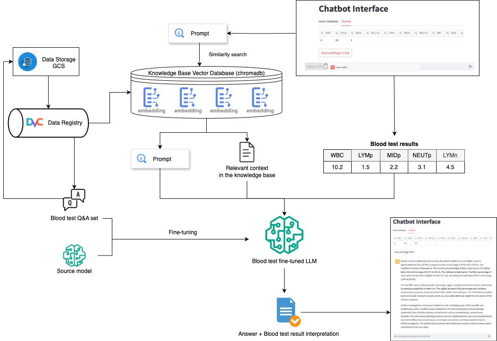

## Milestone 4


#### Project Milestone 4 Organization


```
├── Readme.md
├── src
│   ├── api-service
│   ├── dvc
│   ├── frontend-react
│   ├── scraping
│   ├── vector-db
├── .github/workflows
├── .flask8
├── .gitignore
├── secrets
```


# AC215 - Milestone4 - Bloodwise App


**Team Members**
Lucy Chen, Surabhi Ghatti, Siavash Raissi, Xingli Yu


**Group Name**
Bloodwise


**Project**
The goal of this project is to develop an application that provides users with easy explanations of lab test results based on the provided results and a symptom summary. The app will suggest what the results could mean, and if abnormal, suggest lifestyle changes, specifying to consult with a physician as well. The application will have a chatbot interface using a large language model (LLM) built on retrieval augmented generation (RAG) with accurate medical information.


### Milestone4 ###

In this milestone, we have the components for frontend, API service, also components from previous milestones for data management, including versioning, as well as our initial web-scraping code.

After completions of building a robust ML Pipeline in our previous milestone we have built a backend api service and frontend app. This will be our user-facing application that ties together the various components built in previous milestones.

**Application Design**

Before we start implementing the app we built a detailed design document outlining the application’s architecture. We built a Solution Architecture and Technical Architecture to ensure all our components work together.

Here is our Solution Architecture:


Here is our Technical Architecture:


**Backend API**
We built backend api service using fast API to expose model functionality to the frontend. We also added apis that will help the frontend display some key information about the model and data.


**Frontend API**
A user friendly React app was built to serve as a chat interface for users trying to understand their blood tests results. The chat uses a fine-tuned Gemini LLM model augmented with a RAG pipeline with documents loaded through a vector database, specifically ChromaDB. Using the app, the user can upload a csv of blood test results and/or add additional questions using the chat feature to understand what each individual resutls mean, if they are normal and abnromal, and will provide ways to improve certain abnormal results.


**Data Component Containers**
1. Scraping: processes the scrapped webpages and saves them to a CSV file as well as individual text files to be used for the RAG pipeline.


	  **Input:** None
	
	
	  **Output:** CSV and txt files of scrapped webpages to be used for LLM


2. API-Service: prepares FAST API services to be used for the Frontend REACT web-app. There are 4 primary chatting functions, including one that allows the upload of a csv.


	  **Input:** User inputs and RAG documents from running ChromaDB Instance
	
	
	  **Output:** Endpoint Responses reflected on front-end. 


3. Frontend React: Presents a user-friendly web-app interface to interact with Bloodwise. 
 
	  **Input:** None
	
	
	  **Output:** User-friendly application


4. DVC: sets-up and runs DVC to ensure proper version control of the data being used. 

   	  **Input:** The actual input datasets for LLM and Fine-tuning
	
	
	  **Output:** A small text files (`.dvc`) that contain: 
	- Path to the actual data in the DVC cache, 
	- MD5 hash of the data
	- Information about how to reproduce the data


## Data Containers Overview


Here is a visual of our data pipeline: 

Since each section is containerized, please access the readme’s of each subfolder to run each container:
1. [Scraping](https://github.com/ghattisu/AC215_Bloodwise/tree/milestone4/src/scraping)
2. [Vector DB](https://github.com/ghattisu/AC215_Bloodwise/tree/milestone4/src/vector-db)
3. [API-Service](https://github.com/ghattisu/AC215_Bloodwise/tree/milestone4/src/api-service)
4. [Frontend](https://github.com/ghattisu/AC215_Bloodwise/tree/milestone4/src/frontend-react)
5. [DVC](https://github.com/ghattisu/AC215_Bloodwise/tree/milestone4/src/dvc)

## Container Preview
When run, each section's container and its respective Pipenv virtual environment should appear in the terminal and in DockerHub as:


### Resulting code options for each Container


**Scraping**
```
python cli.py --scrape
python cli.py --upload

```


**Fine-tuning LLM**
```
*Dataset generation:*


python cli.py --generate
python cli.py --prepare
python cli.py --upload


*Gemini Finetuning:*


python cli.py --train
python cli.py --chat

```


**RAG and Deployment**
```
python cli.py --download
python cli.py --chunk
python cli.py --embed
python cli.py --load

```


**DVC**
```
# Current data version
dvc get https://github.com/ghattisu/AC215_Bloodwise.git dvc/datasets --force --quiet --rev milestone2

# Retrieve a different data version, let's try version 1
dvc get https://github.com/ghattisu/AC215_Bloodwise.git dvc/datasets --force --quiet --rev dataset_v1

```
