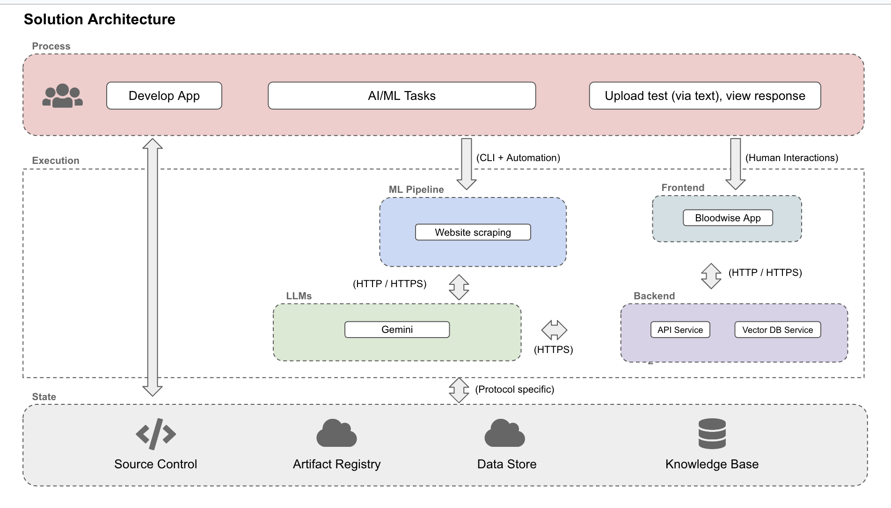
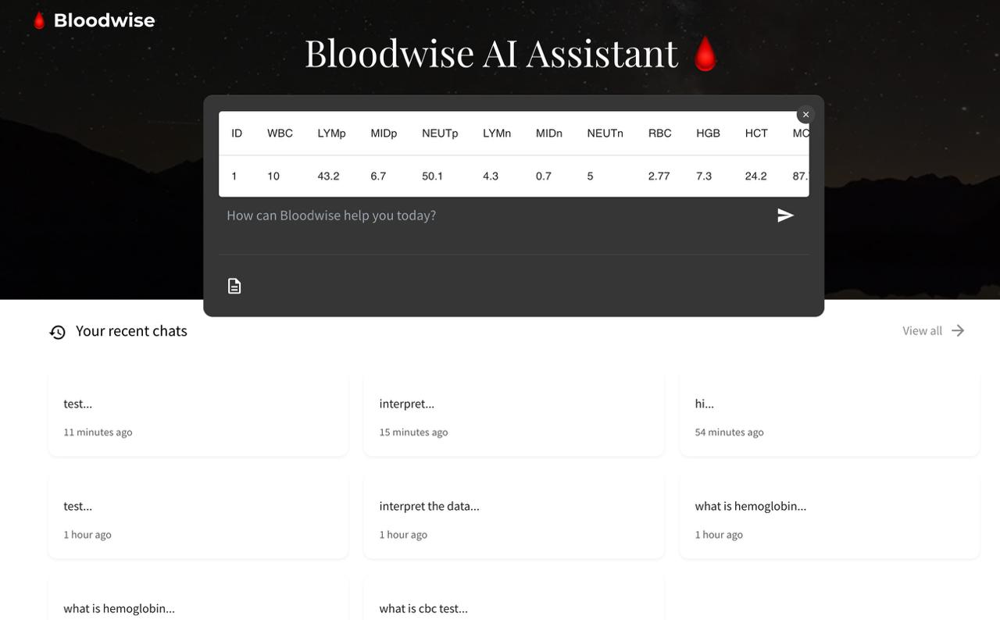

## Milestone 4


#### Project Milestone 4 Organization


```
├── Readme.md
├── images
├── src
│   ├── api-service
│   ├── dvc
│   ├── frontend-react
│   ├── scraping
│   ├── vector-db
├── .github/workflows
├── .flake8
├── .gitignore
├── secrets
```


# AC215 - Milestone4 - Bloodwise App


**Team Members**
Lucy Chen, Surabhi Ghatti, Siavash Raissi, Xingli Yu


**Group Name**
Bloodwise


**Project**
The goal of this project is to develop an application that provides users with easy explanations of lab test results based on the provided results and a symptom summary. The app will suggest what the results could mean, and if abnormal, suggest lifestyle changes, specifying to consult with a physician as well. The application will have a chatbot interface using a large language model (LLM) built on retrieval augmented generation (RAG) with accurate medical information.


### Milestone4 ###

In this milestone, we have the components for frontend, API service, also components from previous milestones for data management, including versioning, as well as our initial web-scraping code.

After completions of building a robust ML Pipeline in our previous milestone we have built a backend api service and frontend app. This will be our user-facing application that ties together the various components built in previous milestones.

**Application Design**

Before we start implementing the app we built a detailed design document outlining the application’s architecture. We built a Solution Architecture and Technical Architecture to ensure all our components work together.

Here is our Solution Architecture:


Here is our Technical Architecture:


**Backend API**

We built backend api service using fast API to expose model functionality to the frontend. We also added apis that will help the frontend display some key information about the model and data.


**Frontend API**

A user friendly React app was built to serve as a chat interface for users trying to understand their blood tests results. The chat uses a fine-tuned Gemini LLM model augmented with a RAG pipeline with documents loaded through a vector database, specifically ChromaDB. Using the app, the user can upload a csv of blood test results and/or add additional questions using the chat feature to understand what each individual resutls mean, if they are normal and abnromal, and will provide ways to improve certain abnormal results.



**Data Component Containers**
1. Scraping: processes the scrapped webpages and saves them to a CSV file as well as individual text files to be used for the RAG pipeline.


	  **Input:** None
	
	
	  **Output:** CSV and txt files of scrapped webpages to be used for LLM

2. Vector DB: Downloads the saved files to instantiate a Chroma DB instance for RAG


	  **Input:** Documents from GCS Bucket
	
	
	  **Output:** Running Vector DB for use in RAG for LLM

3. API-Service: prepares REST API services to be used for the Frontend REACT web-app. There are 4 primary chatting functions, including one that allows the upload of a csv.


	  **Input:** User inputs and RAG documents from running ChromaDB Instance
	
	
	  **Output:** Endpoint Responses reflected on front-end. 


4. Frontend React: Presents a user-friendly web-app interface to interact with Bloodwise. 
 
	  **Input:** None
	
	
	  **Output:** User-friendly application


5. DVC: sets-up and runs DVC to ensure proper version control of the data being used. 

   	  **Input:** The actual input datasets for LLM and Fine-tuning
	
	
	  **Output:** A small text files (`.dvc`) that contain: 
	- Path to the actual data in the DVC cache, 
	- MD5 hash of the data
	- Information about how to reproduce the data


## Data Containers Overview

Since each section is containerized, please access the readme’s of each subfolder to run each container:
1. [Scraping](https://github.com/ghattisu/AC215_Bloodwise/tree/milestone4/src/scraping)
2. [Vector DB](https://github.com/ghattisu/AC215_Bloodwise/tree/milestone4/src/vector-db)
3. [API-Service](https://github.com/ghattisu/AC215_Bloodwise/tree/milestone4/src/api-service)
4. [Frontend](https://github.com/ghattisu/AC215_Bloodwise/tree/milestone4/src/frontend-react)
5. [DVC](https://github.com/ghattisu/AC215_Bloodwise/tree/milestone4/src/dvc)


### Summary Code for Each Container


**Scraping**
```
python cli.py --scrape
python cli.py --upload

```


**Vector DB**
```
python cli.py --download
python cli.py --chunk
python cli.py --embed
python cli.py --load

```


**API Service**
```
uvicorn_server
```

**Frontend React**
```
npm install
npm run dev
```


**DVC**
```
# Current data version
dvc get https://github.com/ghattisu/AC215_Bloodwise.git dvc/datasets --force --quiet --rev milestone2

# Retrieve a different data version, let's try version 1
dvc get https://github.com/ghattisu/AC215_Bloodwise.git dvc/datasets --force --quiet --rev dataset_v1

```

## Testing Overview
The containers Vector DB, API Service, and Scraping have pytest and flake 8 linting enabled on them, with subsequent tests located in their local `tests/` folders. Access each readme of the container to understand what is being tested and how to run the tests locally. The CI Workflow and automation of these testing pipelines can be found in `.github/workflows.`


### Continuous Integration (CI) Workflow
The CI process is triggered whenever code is pushed to the milestone4 branch. Three separate workflow files handle different components of the project:

- `CI_api_service_push.yml`: Handles automated builds, tests, and code quality checks for the api-service component
- `CI_scraping_push.yml`: Manages automated builds, tests, and code quality checks for the scraping component
- `CI_vector_db_push.yml`: Controls automated builds, tests, and code quality checks for the vector-db component

**Workflow Steps**
1. **Repository Checkout**:
Clones the repository into the GitHub Actions runner environment 

2. **Google Cloud Authentication**:
Authenticates with Google Cloud using credentials stored in GitHub secrets. To set up authentication:
	- Navigate to the repository Settings
	- Select "Secrets and variables" → "Actions" from the left sidebar
	- Under "Repository secrets" click "New repository secret"
	- Name your secret (e.g., "GOOGLE_APPLICATION_CREDENTIALS")
	- Paste the contents of your .json file as the secret value

3. **Python Setup**: 
Installs Python on the runner

4. **Docker Compose Setup**: (vector-db only)
Implements caching for Docker Compose to optimize future runs. Installs Docker Compose if not found in cache

5. **Python Dependencies Installation**:
Installs Pipenv for dependency management and project dependencies from Pipfile

6. **Code Quality Check / Linting (Flake8)**:
Executes Flake8 for code style verification and linting

7. **Docker Setup**:
	- **Network Creation** (vector db & api service): Creates a Docker network named 'bloodwise-network' if it doesn't exist
	- **Credentials Setup**: Generates a credentials file from stored secrets
	- **Docker Image Build**: Builds the Docker image

8. **Deployment and Testing**:
Runs pytest with coverage reporting within Docker container, generating a coverage report in HTML format

9. **Coverage Report**:
Uploads the test coverage report as an artifact

**Accessing Test Coverage Reports**
To access the HTML test coverage report generated by each CI pipelines, go to git action -> Artifacts, you can download the `coverage-report.zip` to your local computer. In order to access the pytest results generates by, for example, `CI_api_service_push.yml`, the HTML test coverage report is located in coverage-report -> src -> api-service -> htmlcov -> *.html

To view the HTML test coverage reports:
	1. Go to GitHub Actions
	2. Select the relevant workflow run
	3. Download the `coverage-report.zip` from the Artifacts section

```
coverage-report/
├── Readme.md
├── images
├── src
│   ├── api-service
│   	├── htmlcov
│   		├── *.html
│   ├── dvc
│   ├── frontend-react
│   ├── scraping
│   ├── vector-db
├── credentials.json
├── Pipfile
├── Pipfile.lock
```

Example coverage report:


Each workflow (`CI_scraping_push.yml` and `CI_vector_db_push.yml`) generates its own coverage report, available in their respective artifact sections.
