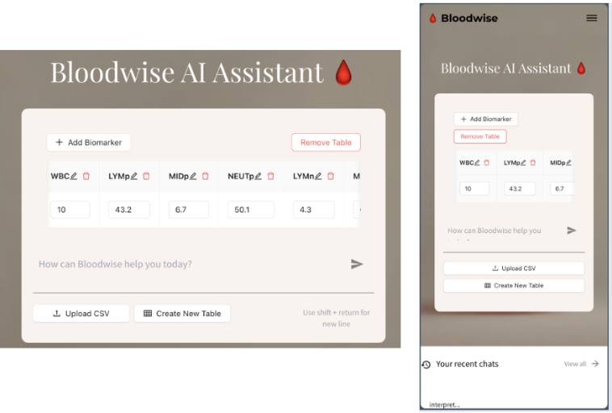

# Bloodwise AI

### **Team Members:**
Lucy Chen, Surabhi Ghatti, Siavash Raissi, Xingli Yu

### **Application Description**
The goal of this project is to develop an application that provides users with easy explanations of lab test results based on the provided results and a symptom summary. The app will suggest what the results could mean, and if abnormal, suggest lifestyle changes, specifying to consult with a physician as well. The application will have a chatbot interface using a large language model (LLM) built on retrieval augmented generation (RAG) with accurate medical information. Users have the option to enter text-based summaries, create a value-based table, and/or upload a csv of results!

<hr style="height:4px;border-width:0;color:gray;background-color:gray">

### Project Organization


```
├── Readme.md
├── images
├── src
│   ├── api-service
│   ├── dvc
│   ├── deploymnent
│   ├── frontend-react
│   ├── scraping
│   ├── vector-db
├── .github/workflows
├── .flake8
├── .gitignore
├── secrets
```

<hr style="height:4px;border-width:0;color:gray;background-color:gray">

### Prerequistes
* Clone repo from [here](https://github.com/ghattisu/AC215_Bloodwise)
* Have Docker installed
* Each specifc module in `src` contains specific instructions on how to run each component (scrapping, vector-db, api-service, frontend-react, and deployment) and what additional prerequisites are needed

**NOTE**: For easy deployment of the full application, go into `src/deployment` and follow the instructions to scale and deploy using Ansbible Playbooks and Kubernetes!

<hr style="height:4px;border-width:0;color:gray;background-color:gray">

### Description of Architecture
To build this application we followed the following solution and technical architecture

Solution Architecture:


Technical Architecture:


<hr style="height:4px;border-width:0;color:gray;background-color:gray">

### Usage of Application
#### Backend APIs
You are able to access the following API's once the application is fully-deployed:


A description of each API can be found in `src/api-service`

#### Frontend React Webpage
A user-friendly React app was built to serve as a chat interface for users trying to understand their blood tests results. The users can ask questions and/or either enter blood test results or upload a csv of test results using the chat input. The users can also add/edit biomarker and biomarker results on the interface and remove blood test tables. The frontend also has a responsive layout to allow mobile interactions. 

Here is an example of the desktop and mobile-friendly interface:


Here is an exmample of how you can enter in your own biomarkers or upload a csv:


Sample output will look like this:


<hr style="height:4px;border-width:0;color:gray;background-color:gray">

### Data Containers Overview

Since each section is containerized, please access the readme’s of each subfolder to run each container:
1. [Scraping](https://github.com/ghattisu/AC215_Bloodwise/tree/milestone5/src/scraping)
2. [Vector DB](https://github.com/ghattisu/AC215_Bloodwise/tree/milestone5/src/vector-db)
3. [API-Service](https://github.com/ghattisu/AC215_Bloodwise/tree/milestone5/src/api-service)
4. [Frontend](https://github.com/ghattisu/AC215_Bloodwise/tree/milestone5/src/frontend-react)
5. [Deployment](https://github.com/ghattisu/AC215_Bloodwise/tree/milestone5/src/deployment)
6. [DVC](https://github.com/ghattisu/AC215_Bloodwise/tree/milestone5/src/dvc)


### Summary Code for Each Container


**Scraping**
```
python cli.py --scrape
python cli.py --chunk
python cli.py --embed
python cli.py --upload

```


**Vector DB**
```
python cli.py --download
python cli.py --load

```


**API Service**
```
uvicorn_server
```

**Frontend React**
```
npm install
npm run dev
```
**Deployment**
```
ansible-playbook deploy-docker-images-app.yml -i inventory.yml
ansible-playbook deploy-k8s-cluster.yml -i inventory.yml --extra-vars cluster_state=present
ansible-playbook deploy-k8s-cluster.yml -i inventory.yml --extra-vars cluster_state=absent
```
**DVC**
```
# Current data version
dvc get https://github.com/ghattisu/AC215_Bloodwise.git dvc/datasets --force --quiet --rev milestone2

# Retrieve a different data version, let's try version 1
dvc get https://github.com/ghattisu/AC215_Bloodwise.git dvc/datasets --force --quiet --rev dataset_v1

```

<hr style="height:4px;border-width:0;color:gray;background-color:gray">

### Known Issues and Limitations
1. Scraping:
	- Due to the real-time change of the websites that are being used for scraping, the current code may break and changes may need to be made to correctly parse through the websites. Scrapping itself also takes quite a long time (avg ~30 mins), so if it seems like the container has been running forever, be sure to check the `input-datasets/` folder that was created.

2. RAG Database Limitations:
	- The system prompt ensures that the LLM primarily draws information from the chunks that are in the RAG database, which is limited to the web sources that we scrapped. There are more nuanced blood panel information that would not be answered with our current chatbot. To remedy this, we reccomend adding more sources to the `scraping/cli.py` to augment the information that is in the database.

3. Kubernets Deployment and Use of Vertex AI
	- Since we are using Google Kubernetes Engine, we are reliant on our GCP credits for any deployment and storage costs, in addition to API calls to Vertex AI for the use of Gemini. Be sure to keep track of billing expenditures, especially when the cluster is deployed. Be sure to delete the cluster when not needed (using the command specified in `src/deployment`).

<hr style="height:4px;border-width:0;color:gray;background-color:gray">

## Testing Overview
The containers Vector DB, API Service, and Scraping have pytest and flake 8 linting enabled on them, with subsequent tests located in their local `tests/` folders. Access each readme of the container to understand what is being tested and how to run the tests locally. The CI Workflow and automation of these testing pipelines can be found in `.github/workflows.` 

**NOTE:** There are no unit tests in deployment or frontend-react since updates to these sections will be tested by the workflow `app-ci-cd-gcp.yml`. 


### Continuous Integration (CI) Workflow
The CI process is triggered whenever code is pushed to the `milestone4` branch. Three separate workflow files handle different components of the project:

- `CI_api_service_push.yml`: Handles automated builds, tests, and code quality checks for the api-service component
- `CI_scraping_push.yml`: Manages automated builds, tests, and code quality checks for the scraping component
- `CI_vector_db_push.yml`: Controls automated builds, tests, and code quality checks for the vector-db component

For each workflow files: 
1. **Repository Checkout**:
Clones the repository into the GitHub Actions runner environment 

2. **Google Cloud Authentication**:
Authenticates with Google Cloud using credentials stored in GitHub secrets. To set up authentication:
	- Navigate to the repository Settings
	- Select "Secrets and variables" → "Actions" from the left sidebar
	- Under "Repository secrets" click "New repository secret"
	- Name your secret (e.g., "GOOGLE_APPLICATION_CREDENTIALS")
	- Paste the contents of your .json file as the secret value

3. **Python Setup**: 
Installs Python on the runner

4. **Docker Compose Setup**: (vector-db only)
Implements caching for Docker Compose to optimize future runs. Installs Docker Compose if not found in cache

5. **Python Dependencies Installation**:
Installs Pipenv for dependency management and project dependencies from Pipfile

6. **Code Quality Check / Linting (Flake8)**:
Executes Flake8 for code style verification and linting

7. **Docker Setup**:
	- **Network Creation** (vector db & api service): Creates a Docker network named 'bloodwise-network' if it doesn't exist
	- **Credentials Setup**: Generates a credentials file from stored secrets
	- **Docker Image Build**: Builds the Docker image

8. **Deployment and Testing**:
Runs pytest with coverage reporting within Docker container, generating a coverage report in HTML format

9. **Coverage Report**:
Uploads the test coverage report as an artifact


##### Accessing Test Coverage Reports

**To view the HTML test coverage reports**:
*  Go to GitHub Actions
*  Select the relevant workflow run
*  Download the `coverage-report.zip` from the Artifacts section

Here is the structure of the coverage-report folder for `CI_api_service_push.yml`: 
```
coverage-report/
├── Readme.md
├── images
├── src
│   ├── api-service
│   	├── htmlcov
│   		├── *.html
│   ├── dvc
│   ├── frontend-react
│   ├── scraping
│   ├── vector-db
├── credentials.json
├── Pipfile
├── Pipfile.lock
```

Example coverage report:


Each workflow (`CI_api_service_push.yml`, `CI_scraping_push.yml` and `CI_vector_db_push.yml`) generates its own coverage report, available in their respective artifact sections.
