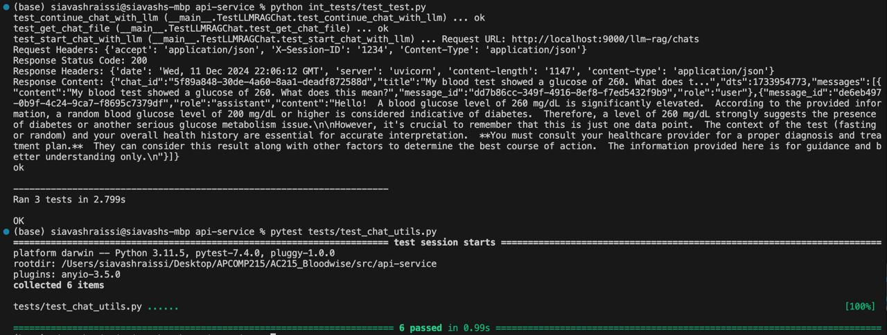

# API Services

This container manages the API functions to initialize the BloodWise AI Chatbot via Google Gemini, route input questions and blood test data to the chatbot, and then output a response to be implemented into the frontend.

## Prerequisites
* Have Docker installed
* Cloned this repository to your local machine https://github.com/ghattisu/AC215_Bloodwise

## Run Container
- Make sure you are inside the `api-service` folder and open a terminal at this location
- Make sure that Docker Desktop is enabled and running
- Run `sh docker-shell.sh`

## This will:
* Launch the API endpoints via FastAPI, hosted on a local port. 
* Allow users to access the API endpoints for testing via their browser.

## Review Container Configuration
- Check `docker-shell.sh`: 
  - Port mapping: `-p 9000:9000`
  - Development mode: `-e DEV=1`
- Check `docker-entrypoint.sh`: Dev vs. Production settings

## Start the API Service

Run the following command within the docker shell: `uvicorn_server`

Verify service is running at `http://localhost:9000`

## View API Docs
Fast API gives us an interactive API documentation and exploration tool for free.
- Go to `http://localhost:9000/docs`
- You can test APIs from this tool
- Here is a description of the available APIs:
  - /llm-rag/chats (GET): returns all chats
  - /llm-rag/chats (POST): returns LLM response for user message
  - /llm-rag/chats/{chat_id} (GET): returns a specific chat for the specified chat_id
  - /llm-rag/chats/{chat_id} (POST): returns LLM response for user message and chat history of a chat_id.
  - /llm-rag/files/{chat_id}/{message_id} (GET): returns an array of the content of a blood test result csv uploaded from a message(message_id) in a chat (chat_id)

## Testing for this container
To run the pytests for this container, use the command `pytest tests/test_chat_utils.py` and for integration tests, `python int_tests/test_test.py`. This test is an integration test that ensure proper API connection, ChromaDB instantiation, and connection to Vertex AI Gemini.

Example of the integration tests running locally.

Initial setup:
- There is a mock ChatHistoryManager and a mock Chat message that are used to replicate what it would be like to retrieve previous chats and saving off a current chat using the various endpoints. The mock ChatHistoryManager has instances of previous chats to be used for testing and the mock Chat message mimics a real chat that would also test the functionalities of the API.

Functions tested:
- test_ensure_directories(): tests to make sure the the history and files (saving csv files) directory exists 
- test_save_chat(): uses the mock Chat message to see if a current chat can be saved
- test_get_chat(): uses the mock Chat message to see if a previous chat can be returned using its session-id
- test_get_recent_chats(): returns all the recent chats 
- test_save_file(): tests to make sure that uploaded csv's are saved off
- test_load_file(): uses mock ChatHistoryManager to retrieve previously saved off csv files using both the chat-id and message-id
- test_start_chat_with_llm(): API service connects to ChromaDB and attempts to start a new LLM chat
- test_continue_chat_with_llm(): with an existing chat ID, tests if the API service is capable of retrieving previous chats and continuing them
- test_get_chat_file(): tests if the API service is capable of receiving and processing files with a mock csv
