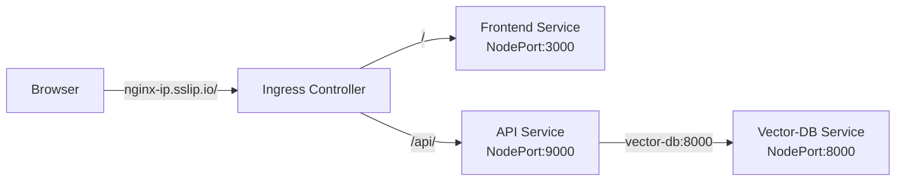

## Deployment of Bloodwise AI

This application can be deployed using Ansible Playbooks and Google Kubernetes Engine! The steps below will help you set up your credentials, push docker images to Google Container Registry, and deploy a cluster for easy deployment of the application. We also apply Continuous Integration and Continuous Deployment (CI/CD) methods to test, execute, monitor, deploy, and scale these components. All of these steps will be automated based on workflow using GitHub Actions. Here are the components we have built for our Bloodwise App:

* Scraping: Scrapes Docus AI and Cleveland Clinic for blood test panel and biomarker information to be used as database for RAG. Will chunk and store the embeddings in a Google Cloud Bucket.
* Vector DB: Downloads the embeddings from the Google Cloud Bucket and loads them into a ChromaDB instance for the RAG Database.
* API Service: FastAPI service to expose APIs to the frontend.
* Frontend:  React Frontend for the bloodwise app.

<hr style="height:4px;border-width:0;color:gray;background-color:gray">

### Prerequistes
- Clone repo from [here](https://github.com/ghattisu/AC215_Bloodwise)
- Have Docker Installed

<hr style="height:4px;border-width:0;color:gray;background-color:gray">

### API's to enable in GCP for Project
Search for each of these in the GCP search bar and click enable to enable these API's
* Vertex AI API
* Compute Engine API
* Service Usage API
* Cloud Resource Manager API
* Google Container Registry API
* Kubernetes Engine API

### Setup GCP Service Account for deployment
- Here are the step to create a service account:
- To setup a service account you will need to go to [GCP Console](https://console.cloud.google.com/home/dashboard), search for  "Service accounts" from the top search box. or go to: "IAM & Admins" > "Service accounts" from the top-left menu and create a new service account called "deployment". 
- Give the following roles:
- For `deployment`:
    - Compute Admin
    - Compute OS Login
    - Container Registry Service Agent
    - Kubernetes Engine Admin
    - Service Account User
    - Storage Admin
    - Artifact Registry Administrator
    - Artifact Registry Create-on-Push Repository Administrator
    - Artifact Registry Create-on-Push Writer
    - Artifact Registry Writer
- Then click done.
- This will create a service account
- On the right "Actions" column click the vertical ... and select "Create key". A prompt for Create private key for "deployment" will appear select "JSON" and click create. This will download a Private key json file to your computer. Copy this json file into the **secrets** folder.
- Rename the json key file to `deployment.json`
- Follow the same process Create another service account called `gcp-service`
- For `gcp-service` give the following roles:
    - Storage Object Viewer
    - Vertex AI Administrator
- Then click done.
- This will create a service account
- On the right "Actions" column click the vertical ... and select "Create key". A prompt for Create private key for "gcp-service" will appear select "JSON" and click create. This will download a Private key json file to your computer. Copy this json file into the **secrets** folder.
- Rename the json key file to `gcp-service.json`

<hr style="height:4px;border-width:0;color:gray;background-color:gray">

### Setup Docker Container (Ansible, Docker, Kubernetes)

Rather than each of installing different tools for deployment we will use Docker to build and run a standard container will all required software.

### Run `deployment` container
- cd into `deployment`
- Go into `docker-shell.sh` and change the field `GCP_PROJECT` to your relevant project
- Run `sh docker-shell.sh` 


- Check versions of tools:
```
gcloud --version
ansible --version
kubectl version --client
```

- Check to make sure you are authenticated to GCP
- Run `gcloud auth list` and follow any subsequent steps that follow

### SSH Setup
##### Configuring OS Login for service account
Run this within the `deployment` container
```
gcloud compute project-info add-metadata --project <YOUR GCP_PROJECT> --metadata enable-oslogin=TRUE
```
example: 
```
gcloud compute project-info add-metadata --project bloodwise-ai --metadata enable-oslogin=TRUE
```

#### Create SSH key for service account
```
cd /secrets
ssh-keygen -f ssh-key-deployment
cd /app
```

#### Providing public SSH keys to instances
```
gcloud compute os-login ssh-keys add --key-file=/secrets/ssh-key-deployment.pub
```
From the output of the above command keep note of the username. Here is a snippet of the output 
```
- accountId: bloodwise-ai
    gid: '3906553998'
    homeDirectory: /home/sa_100110341521630214262
    name: users/deployment@ac215-project.iam.gserviceaccount.com/projects/ac215-project
    operatingSystemType: LINUX
    primary: true
    uid: '3906553998'
	...
    username: sa_100110341521630214262
```
The username is `sa_100110341521630214262`

### Deployment Setup
* Add ansible user details in inventory.yml file
* GCP project details in inventory.yml file
* GCP Compute instance details in inventory.yml file

<hr style="height:4px;border-width:0;color:gray;background-color:gray">

### Deployment

### Build and Push Docker Containers to GCR (Google Artifact Registry)
```
ansible-playbook deploy-docker-images-app.yml -i inventory.yml
```

You can view your pushed images in [Google Artifact Registry](https://console.cloud.google.com/artifacts/docker/bloodwise-ai/us/gcr.io?authuser=2&hl=en&project=bloodwise-ai)


### Create & Deploy Cluster
```
ansible-playbook deploy-k8s-cluster.yml -i inventory.yml --extra-vars cluster_state=present
```

If this is successful, you should see this in your terminal:


And when you go to [GCP Clusters](https://console.cloud.google.com/kubernetes/list/overview?referrer=search&authuser=2&hl=en&project=bloodwise-ai), you should see:


Here is how the various services communicate between each other in the Kubernetes cluster.



### Try some kubectl commands
```
kubectl get all
kubectl get all --all-namespaces
kubectl get pods --all-namespaces
```

```
kubectl get componentstatuses
kubectl get nodes
```

### If you want to shell into a container in a Pod
```
kubectl get pods --namespace=bloodwise-cluster-namespace
kubectl get pod api-5d4878c545-47754 --namespace=bloodwise-cluster-namespace
kubectl exec --stdin --tty api-5d4878c545-47754 --namespace=bloodwise-cluster-namespace  -- /bin/bash
```

### View the App (If you have a domain)
1. Get your ingress IP:
   * Copy the `nginx_ingress_ip` value that was displayed in the terminal after running the cluster creation command or from GCP console -> Kubernetes > Gateways, Services & Ingress > INGRESS

   * Example IP: `34.148.61.120`

2. Configure your domain DNS settings:
   * Go to your domain provider's website (e.g., GoDaddy, Namecheap, etc.)
   * Find the DNS settings or DNS management section
   * Add a new 'A Record' with:
     - Host/Name: `@` (or leave blank, depending on provider)
     - Points to/Value: Your `nginx_ingress_ip`
     - TTL: 3600 (or default)

3. Wait for DNS propagation (can take 5-30 minutes)

4. Access your app:
   * Go to: `http://your-domain.com`
   * Example: `http://bloodwise.ai`

### View the App (If you do not have a domain)
* Copy the `nginx_ingress_ip` from the terminal from the create cluster command
* Go to `http://<YOUR INGRESS IP>.sslip.io`

* Example: http://34.56.18.100.sslip.io/

Here is a preview of the launched application:


<hr style="height:4px;border-width:0;color:gray;background-color:gray">

### Update Existing Cluster
```
sh deploy-k8s-update.sh
```

### Delete Cluster
```
ansible-playbook deploy-k8s-cluster.yml -i inventory.yml --extra-vars cluster_state=absent
```
<hr style="height:4px;border-width:0;color:gray;background-color:gray">

### Debugging Containers

If you want to debug any of the containers to see if something is wrong

* View running containers
```
sudo docker container ls
```

* View images
```
sudo docker image ls
```

* View logs
```
sudo docker container logs api-service -f
sudo docker container logs frontend -f
sudo docker container logs nginx -f
```

* Get into shell
```
sudo docker exec -it api-service /bin/bash
sudo docker exec -it frontend /bin/bash
sudo docker exec -it nginx /bin/bash
```


```
# Check the init container logs:
kubectl logs -n bloodwise-cluster-namespace job/vector-db-loader -c wait-for-chromadb

# Check the main container logs:
kubectl logs -n bloodwise-cluster-namespace job/vector-db-loader -c vector-db-loader

# Check the job status:
kubectl describe job vector-db-loader -n bloodwise-cluster-namespace


# First, find the pod name for your job
kubectl get pods -n bloodwise-cluster-namespace | grep vector-db-loader

# Then get the logs from that pod (replace <pod-name> with the actual name)
kubectl logs -n bloodwise-cluster-namespace <pod-name>
kubectl logs -n bloodwise-cluster-namespace vector-db-loader-9gr5m

# If you want to see logs from the init container specifically
kubectl logs -n bloodwise-cluster-namespace <pod-name> -c wait-for-chromadb
kubectl logs -n bloodwise-cluster-namespace vector-db-loader-wlfdx -c wait-for-chromadb

# If you want to see logs from the main container
kubectl logs -n bloodwise-cluster-namespace <pod-name> -c vector-db-loader
kubectl logs -n bloodwise-cluster-namespace vector-db-loader-wlfdx -c vector-db-loader

# You can also get logs directly from the job (this will show logs from the most recent pod)
kubectl logs job/vector-db-loader -n bloodwise-cluster-namespace

# To see previous logs if the pod has restarted
kubectl logs job/vector-db-loader -n bloodwise-cluster-namespace --previous


# View logs from the current API pod
kubectl logs deployment/api -n bloodwise-cluster-namespace

# Follow the logs
kubectl logs deployment/api -n bloodwise-cluster-namespace -f
```
