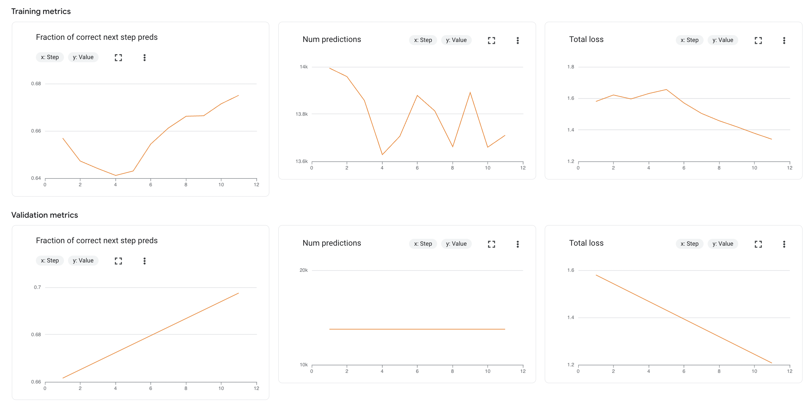
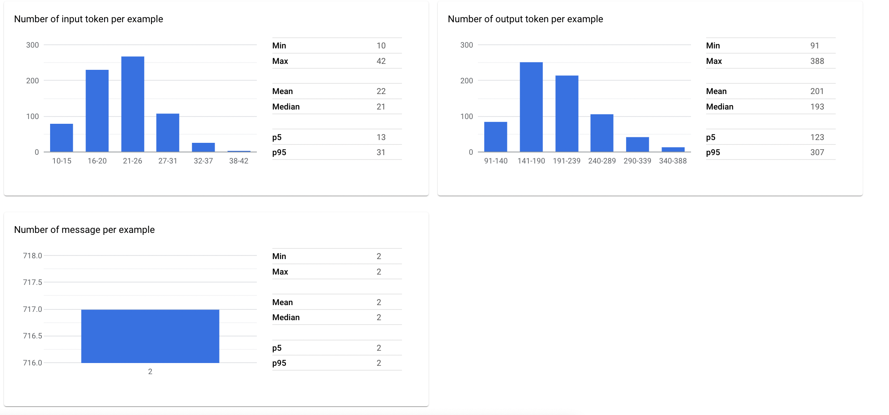

# Fine-tuning an LLM

In this container, we will be fine-tuning the gemini-1.5-flash-002 model from Vertex AI! It will cover:
- Dataset creation
- Fine-tuning Gemini

## Prerequisites
* Have Docker installed
* Cloned this repository to your local machine https://github.com/ghattisu/AC215_Bloodwise
* Modify `env.dev` to represent your Bucket and Project Name, as well as your Credentials!

## Setup GCP Service Account
- To set up a service account, go to the [GCP Console](https://console.cloud.google.com/home/dashboard), search for "Service accounts" in the top search box, or navigate to "IAM & Admin" > "Service accounts" from the top-left menu. 
- Create a new service account called "llm-service-account." 
- In "Grant this service account access to project" select:
    - Storage Admin
    - Vertex AI User
- This will create a service account.
- Click the service account and navigate to the tab "KEYS"
- Click the button "ADD Key (Create New Key)" and Select "JSON". This will download a private key JSON file to your computer. 
- Copy this JSON file into the **secrets** folder and rename it to `llm-service-account.json`.

Your folder structure should look like:
```
    ├── Readme.md
    ├── images
    ├── src
    │   ├── api-service
    │   ├── dvc
    │   ├── frontend-react
    │   ├── scraping
    │   ├── vector-db
    │   ├── fine=tuning
    ├── .github/workflows
    ├── .flask8
    ├── .gitignore
    ├── secrets
```

## Run LLM RAG Container
- Make sure you are inside the `dataset-creator` folder and open a terminal at this location
- Run `sh docker-shell.sh`

### Create a Question/Answer Dataset

**NOTE: Due to the senstitivity of this data, and the saftey features added to the generation, there might not be a total of 1000 question/answer pairs.**

`python cli.py --generate`

This will:
* Generate a sample dataset of ~1000 question/answer pairs explaining blood test results and providing guidance on lifestype and eating for any mediation of abnormal values. This will take approxiamtley 10-15 minutes due to the volume of generation.
* Print the total number of pairs actually generated. 

#### System Prompt

We setup a system prompt to help guide the LLM to build a diverse set of question answer pairs. The detail prompt can been seen in `cli.py`. Specifically look at how we ask the LLm to generate question answer pairs in a medical professional's style:


```
...
Answer Format:
   - Begin each answer with a professional and reassuring introduction that establishes our medical guide's expertise. For example:
     * "Hello, this is your online physician. I'm here to help you understand your blood test results."
     * "Good day, I'm your medical guide for interpreting these test results."
     * "Welcome to your health consultation. I'm your online medical guide, and I'll be explaining your blood work today."
   - Include clear, factual information that brings the physician's expertise to life, such as:
     * "Based on current medical guidelines, a healthy total cholesterol level is generally below 200 mg/dL."
     * "Recent studies have shown that regular exercise can significantly improve your HDL cholesterol levels."
     * "It's important to remember that blood test results are just one part of your overall health picture."
   - Incorporate reassuring and motivational phrases to enhance our medical guide's character:
     * "Don't worry, many of my patients have successfully improved their blood sugar levels with the right approach."
     * "Small, consistent changes in your diet can lead to significant improvements in your health markers."
     * "Remember, your health journey is unique, and we're here to support you every step of the way."
...

```

#### Input Prompt

We give an input prompt for the LLM:

```
Generate 20 diverse, informative, and engaging question-answer pairs about medical blood test results, their interpretation, and related lifestyle and dietary advice. Follow these guidelines:
        1. Ensure each pair is independent and self-contained.
        2. Embody the professional, compassionate, and knowledgeable tone of a medical guide, an experienced physician with nutritional expertise.
        3. Incorporate relevant medical and nutritional information, including current health guidelines and research findings.
        4. Keep all content in English, explaining medical terms when first introduced.
        5. Address all answers directly from a medical guide, maintaining a respectful and equitable approach to all patients.
        6. Include a mix of questions about common blood tests, their significance, interpretation of results, lifestyle changes, dietary recommendations, and their impact on health markers.
        7.Emphasize the importance of consulting with healthcare providers for personalized medical advice.
        8. Ensure accuracy and relevance of all medical information provided.
```

#### Number of Iterations of question generation

Change the number of iterations to build a larger dataset. It will cost approximately $2.0 for 1000 iterations.
```
NUM_ITERATIONS = 50
```

### Sample Question Answers

Here are some sample results from when you run the `--generate` option from the above step:

```
[
{
    "question": "What is a CBC blood test, and what can it tell us about my overall health?",
    "answer": "Hello, this is your online physician. I'm here to help you understand your blood test results. A CBC, or complete blood count, is a fundamental blood test that provides a detailed picture of your blood components, including red blood cells, white blood cells, and platelets. It's a valuable tool for assessing your overall health and detecting potential issues like anemia, infections, and blood clotting disorders. The CBC measures various parameters, including the number of each type of blood cell, their size, and their shape. For instance, a low red blood cell count might indicate anemia, a condition characterized by low oxygen-carrying capacity in the blood. High white blood cell count could suggest an infection or inflammation. Analyzing platelet count helps assess your blood clotting ability.  A CBC can be used to monitor various health conditions, detect early signs of illness, and track the effectiveness of treatments. It's often part of routine health check-ups and can be ordered when you're experiencing symptoms like fatigue, fever, or bruising easily. Remember, blood test results are just one part of your overall health picture, and it's always best to discuss your results with your doctor for a comprehensive evaluation and personalized guidance."
  },
  {
    "question": "I've heard about 'good' and 'bad' cholesterol. Can you explain what these mean and how they affect my health?",
    "answer": "Good day, I'm your medical guide for interpreting these test results. Cholesterol is a waxy substance essential for cell function and hormone production. However, high levels of certain types of cholesterol can contribute to heart disease.  'Good' cholesterol, or high-density lipoprotein (HDL), transports cholesterol from the body back to the liver for processing, helping to clear arteries. A higher HDL level is generally beneficial. On the other hand, 'bad' cholesterol, or low-density lipoprotein (LDL), can accumulate in the arteries, leading to plaque buildup and hardening of the arteries, increasing the risk of heart attack or stroke.  A lipid panel, a blood test that measures various cholesterol levels, is essential for assessing your heart health.  It includes total cholesterol, HDL, LDL, and triglycerides.  Based on current medical guidelines, a healthy total cholesterol level is generally below 200 mg/dL. Ideally, LDL should be below 100 mg/dL, and HDL should be above 60 mg/dL. Remember, these are general guidelines, and your individual targets may vary depending on factors like age, family history, and other health conditions. Always discuss your lipid panel results with your doctor to receive personalized advice and recommendations."
  }
  ...
]
```


### Prepare Question/Answer Dataset
`python cli.py --prepare`

This will:
* This step will combine all the .txt files are consolidate it into csv and jsonl files.

For Gemini fine-tuning the required data format is as shown below:
```
{
  "contents": [
    {
      "role": "user",
      "parts": [
        {
          "text": "What is a CBC blood test, and what can it tell us about my overall health?"
        }
      ]
    },
    {
      "role": "model",
      "parts": [
        {
          "text": "Hello, this is your online physician. I'm here to help you understand your blood test results. A CBC, or complete blood count, is a fundamental blood test that provides a detailed picture of your blood components, including red blood cells, white blood cells, and platelets. It's a valuable tool for assessing your overall health and detecting potential issues like anemia, infections, and blood clotting disorders. The CBC measures various parameters, including the number of each type of blood cell, their size, and their shape. For instance, a low red blood cell count might indicate anemia, a condition characterized by low oxygen-carrying capacity in the blood. High white blood cell count could suggest an infection or inflammation. Analyzing platelet count helps assess your blood clotting ability.  A CBC can be used to monitor various health conditions, detect early signs of illness, and track the effectiveness of treatments. It's often part of routine health check-ups and can be ordered when you're experiencing symptoms like fatigue, fever, or bruising easily. Remember, blood test results are just one part of your overall health picture, and it's always best to discuss your results with your doctor for a comprehensive evaluation and personalized guidance."
        }
      ]
    }
  ]
}
```
**NOTE: You will also notice if any of the files error, and by default, they will not be uploaded into the final instruction set that is uploaded. Some common errors and their fixes are listed below if you would like to correct and rerun `python cli.py --prepare`**
- *"Expecting ',' delimiter:* this indicates that there is a comma missing on a certain line. You can navigate to the line in the .txt file and add it (it usually happens after a question is asked)
- *'Invalid control character*: this usually occurs when the answer returned is a bulleted list and seperated onto different lines.
    - you can add a `\n` character to each line (if not present), select all of the lines and `ctrl + j` to combine into one line.

### Upload Dataset
In this step we upload our dataset to a GCP bucket so we can using it in our downstream tasks.

- Run `python cli.py --upload`

## Fine-tune Gemini

### Run Container
- Make sure you are inside the `gemini-finetuner` folder and open a terminal at this location
- Run `sh docker-shell.sh`

### Fine-tune Model
- Run `python cli.py --train` to fine-tune the Gemini model
- Change any of the default parameters if needed

You can view the status of your tuning job on [Vertex AI](https://console.cloud.google.com/vertex-ai/studio/tuning)

### Deploy model to endpoint
- To ensure that you have an active endpoint to chat with, go to https://console.cloud.google.com/vertex-ai/online-prediction/endpoints. You might see an endpoint associated with your model, but if you never recieved an email from Vertex AI, then the deployment did not go through.
- If this is the case, go to https://console.cloud.google.com/vertex-ai/models
- You should see the model you just finetuned! Click the 3 dots on the right and choose **Deploy to Endpoint** 
- Choose **Create an Endpoint** and give it a name.
- Keep all the other default settings.
- Now when you navigate to https://console.cloud.google.com/vertex-ai/online-prediction/endpoints you should see the endpoint you just deployed! Click on the endpoint to grab the enpoint link to add to `cli.py`


### Chat with Fine-tuned Model
- Run `python cli.py --chat`

This will:
* Takes a sample query
* Ask fine tuned LLM for a response

Example:
```
Hi! I just got my blood test results back and it shows that my LDL level is 160 mg/DL. What does this mean?

Fine-tuned LLM Response: 

An LDL cholesterol level of 160 mg/dL is considered high, placing you at increased risk for heart disease. Ideally, LDL cholesterol should be below 100 mg/dL. Levels above 160 mg/dL significantly increase your risk of developing atherosclerosis (plaque buildup in arteries), which can lead to heart attack or stroke.

Do not attempt to self-treat. This result requires discussion with your doctor or a healthcare professional. They will:

- Evaluate your overall cardiovascular risk: Your LDL level is one piece of the puzzle. Other factors like age, family history, blood pressure, HDL cholesterol, triglycerides, smoking status, and existing health conditions are also crucial.
- Recommend lifestyle modifications: This may include a heart-healthy diet lower in saturated and trans fats, increased physical activity, and weight management if needed.
- Discuss medication options: Depending on your overall risk profile and response to lifestyle changes, your doctor might recommend medication, such as statins, to lower your LDL cholesterol.

It's important to get personalized advice and develop a plan tailored to your individual circumstances. Schedule an appointment with your doctor to discuss these results.

```

If you go to [Vertex AI Tuning](https://console.cloud.google.com/vertex-ai/studio/tuning) you can view all the detail from training.

#### Decision for Choices of Fine-tuning
We were debating between using a pre-composed health dataset which had vitals and some blood test information vs creating our own dataset to fine-tune. Ultimately, we chose to create our own dataset since the pre-composed dataset did not contain information specific enough on understanding blood test results and providing lifestyle changes. This is why we decided to create our own dataset. We only experimented with Gemini due to a recommendation from our Mentor, as we all prior experience using Vertex AI through GCP.

Training Monitor:


Data distribution:

